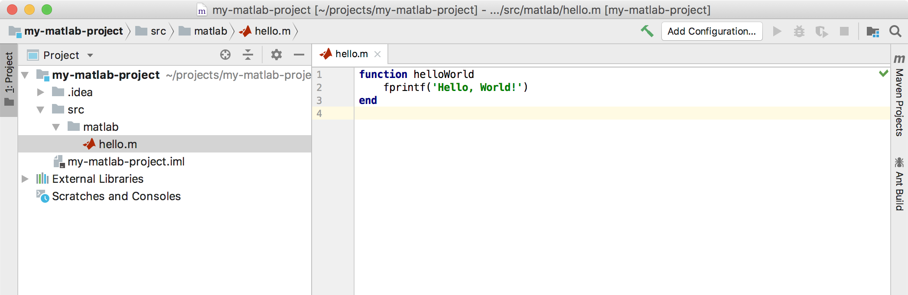

# Matlab support for IntelliJ
Matlab syntax highlighting plugin for JetBrains IDEs.

https://plugins.jetbrains.com/plugin/10941-matlab-support

## Installation
 1. Open **Settings | Plugins** (Windows) or **Preferences | Plugins** (MacOS)
 2. Click **Browse repositories...**
 3. Type _Matlab Support_ in search bar
 4. Click **Install**

## Running matlab files from IDE
 1. Right click on .m file in files tree.
 2. Choose **Run 'helloWorld.m'**.
 3. If you do it for the first time you'll see an error message telling you that interpreter is not specified.
    1. To fix it open **Run | Edit configuration...** choose created configuration and specify path to `matlab` executable.  
    Tip: you can specify path to any other program that runs .m files like [Octave].
    
 4. You can save generated run configuration so it will not be removed.
 To do it open **Run | Edit configuration...** choose the configuration and click **Save** icon.

Note: currently `Program arguments` field in configuration is ignored.
 
## Development

For easier development install [Grammar-Kit](https://plugins.jetbrains.com/plugin/6606-grammar-kit) plugin.

Follow these steps to start working on the plugin:
1. Clone project and import it to IntelliJ IDEA as Gradle project.
2. Run/Debug `runIde` Gradle task.

### How to re-generate parser

After you made changes to bnf or flex files you need to generate new lexer/parser code:
 
1. Generate Matlab lexers. Open [MatlabLexer.flex](grammar/MatlabLexer.flex) and click **Run JFlex Generator** from context menu, do the same for [SingleQuoteStringLexer.flex](grammar/SingleQuoteStringLexer.flex).
2. Generate Matlab parser. Open [Matlab.bnf](grammar/Matlab.bnf) and run **Generate Parser Code** from context menu.

If you have any issue with setting up development environment then please create an issue.

The project is written in Kotlin. It's pretty easy to learn. To get started you may quickly look through [Basic Syntax](https://kotlinlang.org/docs/reference/basic-syntax.html) and [Classes and Inheritance](https://kotlinlang.org/docs/reference/classes.html).  
Contributions in Java are also welcomed.

To build a jar with Matlab Plugin run `buildPlugin` Gradle task.

### Tips for plugin developers

1. _View PSI Structure._
  When you start IDEA with `runIde` Gradle task you may open a matlab file in the IDE and run **View PSI Structure of Current File..** action.

 [Octave]: https://www.gnu.org/software/octave/
